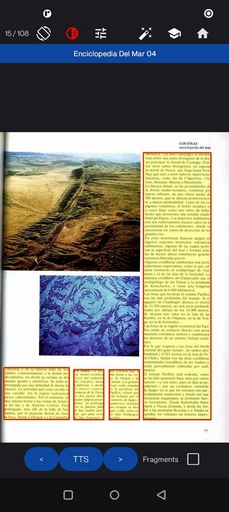
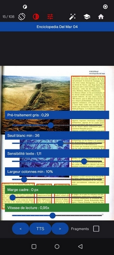

# PDF TTS Reader Project

This Android project helps to read PDF files using Text-to-Speech (TTS). It performs a text search on each page of the PDF and allows the user to adjust settings to facilitate text search within the document pages.

**This is a personal project that I am sharing here. I plan to gradually improve and optimize it.**

## Features

* Read PDF files in TTS (Text-to-Speech) mode.
* Search for text on each page of the PDF, page by page.
* Configurable settings to adjust text search within pages.
* Simple and user-friendly interface for easy use.

</p>

|  |  |
|----------------------------|----------------------------|

[Manuel d'utilisation en français](./Doc/Manuel_d_utilisation.pdf)

[User_Manual](./Doc/User_Manual.pdf)

## Requirements

* Android 13 (API level 33) or higher.
* Access to a PDF file to read.
* An internet connection (to download dependencies if needed).

## Installation

1. Clone this project to your machine:

   ```bash
   git clone https://github.com/your-username/your-project.git
   ```

2. Open the project in Android Studio.

3. Build and run the application on a device or emulator.

## Project Setup

The project uses the following SDK and library versions:

* **Compile SDK**: 36 (Android 14)
* **Min SDK**: 21 (Android 5.0 Lollipop)
* **Application ID**: `com.example.scan_ocr_tts`
* **Libraries**:

  * Kotlin
  * Jetpack Compose

## Usage

1. Open a PDF file to read.
2. Adjust the settings to modify the text search.
3. Start reading and let the app read the text page by page.

## License

This project is under the MIT license – see the [LICENSE](LICENSE) file for more details.


